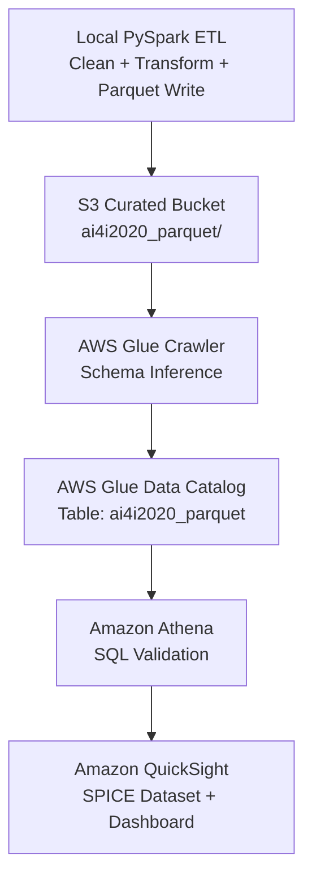

# 🏭 AWS Industrial Machine Failure Analysis  
### End-to-End AWS Data Engineering + Analytics Pipeline (AI4I Dataset)

This project builds a complete AWS-based analytics pipeline to analyze industrial IoT machine failure data using services like **S3, Glue Crawler, Athena, and QuickSight**.  
A curated Parquet dataset is created using PySpark, cataloged using Glue, queried using Athena, and visualized in QuickSight.

---

## 🚀 Project Architecture



---

## 📂 Data Flow Breakdown

### **1️⃣ PySpark ETL**
- Load raw AI4I dataset  
- Clean and prepare features  
- Convert to **Parquet**  
- Upload to S3 curated bucket  
  - `s3://walbrydge-curated-sampreethi/ai4i2020_parquet/`

---

### **2️⃣ Amazon S3 (Curated Zone)**
Stores optimized Parquet files for analytics workloads.

---

### **3️⃣ AWS Glue Crawler**
- Scans the Parquet folder  
- Creates a table in the Glue Data Catalog  
- Database: **walbrydge_curated_db**  
- Table: **ai4i2020_parquet**

---

### **4️⃣ Amazon Athena**
Used to:
- Validate schema
- Preview table data
- Run SQL queries
- Verify successful ingestion  
Example query:

```sql
SELECT * FROM walbrydge_curated_db.ai4i2020_parquet LIMIT 10;
```
https://github.com/Sampreethi66/aws-industrial-machine-failure-analysis/blob/main/assets/dashboard.png
---

### **5️⃣ Amazon QuickSight**
- Athena → SPICE dataset  
- Built a full analytics dashboard showing:
  - Machine failure counts  
  - Temperature vs failure  
  - Torque analysis  
  - Tool wear vs temperature interactions  

---

## 📊 Dashboard Preview

_Add screenshot below after uploading the file into the `assets/` folder:_


## 📊 Dashboard Preview


---

## 🐝 Glue Crawler Result


---

## 🔍 Athena Query Output


---

## 🧠 What This Project Demonstrates

✔ AWS Data Engineering fundamentals  
✔ PySpark ETL & Parquet optimization  
✔ Automated Glue Crawler metadata management  
✔ SQL analytics using Athena  
✔ Interactive dashboards in QuickSight  
✔ Best practices for S3 data zones (Curated, Raw)  
✔ End-to-end reproducible cloud pipeline  

---

## 🛠 Tools & Technologies

| Layer | Services / Tools |
|------|------------------|
| Storage | Amazon S3 |
| Metadata | AWS Glue Crawler, Glue Data Catalog |
| Query Engine | Amazon Athena |
| Visualization | Amazon QuickSight |
| ETL | PySpark / Local Python |
| Data Format | Parquet |

---

## 📝 Future Enhancements

- Add ML predictions for machine failure  
- Deploy using AWS Lambda + Step Functions  
- Automate ETL using AWS Glue Spark Jobs  

---

## 👤 Author

**Sampreethi Bokka**  
M.S. Business Analytics & AI — UT Dallas  
GitHub: https://github.com/Sampreethi66  
LinkedIn: https://linkedin.com/in/sampreethi-bokka  

---

